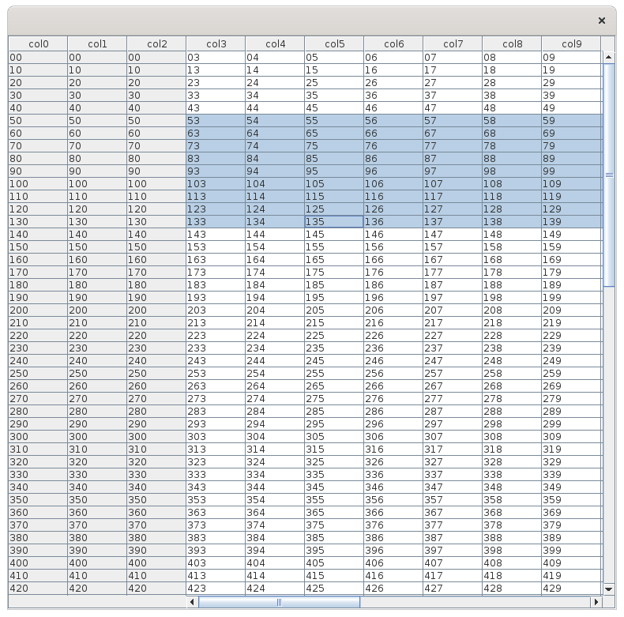

# Frozen Column Table

## Description
A table that shows several columns as an always visible row header

## Screenshots



## Execution

Example provides a main class for jar and mvn exec so you can run either with:

```
mvn exec:java
```

or

```
mvn package
java -jar target/*.jar
```

## Credits

Based on original example from http://fahdshariff.blogspot.com/2010/02/freezing-columns-in-jtable.html
